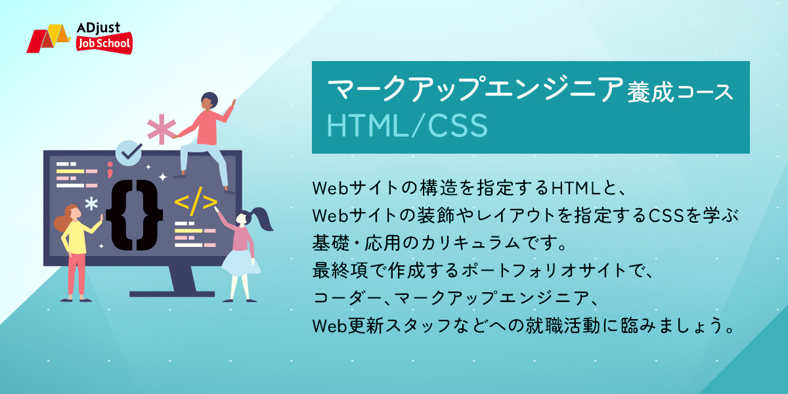

% 前提条件
% 基本的なコンピューターリテラシー、基本的なソフトウェアがインストールされている(https://developer.mozilla.org/ja/docs/Learn/Getting_started_with_the_web/Installing_basic_software)こと、ファイルの扱い(https://developer.mozilla.org/ja/docs/Learn/Getting_started_with_the_web/Dealing_with_filesa)

# カリキュラムへようこそ

<div>

</div>

## `macOS`について

```{hint}
**`macOS`をご利用の方へ**

このテキストは`Windows`中心に書かれています。

**`macOS`でも受講可能**ですが、ショートカットキーやアプリケーションのインストール方法・操作方法など細部が異なります。
`macOS`の方は適宜ご自分で調査していただくか、また質問会にてサポートさせていただきます。
```

## ウェブサイト（ホームページ）は何でできている？ ― マークアップエンジニアというお仕事

世の中に無数にあるウェブサイト（ホームページ）は、どんなにきらびやかでも、その中身は「{term}`コード`」と言われる「文字」でできています。

```{figure} images/gyazo/6e1d3c18bfd55da080ac535a221dce82.jpg
こんなデザイン✨のページも...
```

```{figure} images/gyazo/494caa042791fd1e2f87e548447987b9.png
一皮むけば、こんな{term}`コード`でできています。この{term}`コード`でどの素材をどこに配置するのかを決めています。
```

この{term}`コード`を作る専門家のことを「{term}`マークアップエンジニア`（{term}`コーダー`）」と言い、{term}`コード`を書くことを「{term}`コーディング`」と言います。
{term}`コーディング`には{term}`HTML`と{term}`CSS`という２種類のコンピューター言語を用いますので、{term}`マークアップエンジニア`になるにはこの２つを習得することが必要です。


`````{admonition} 用語
````{glossary}
コード
	コンピューターにとって意味のあるテキスト（文字）のことをコードと言います。

コーディング
	{term}`コード`を書く作業のことをコーディングと言います。

マークアップエンジニア
コーダー
	`HTML`言語と`CSS`言語の２つの言語の専門家で、これら２つの言語を駆使してデザイナーが設計した{term}`ウェブページ`を実際に実装する役割を担います。
	現場によりマークアップエンジニアのことをコーダーと呼ぶこともあります。
````
````` 

ウェブサイトの制作ではおおまかに以下の工程があり、{term}`マークアップエンジニア`はデザイナーが仕上げたデザインどおりに{term}`コーディング`し、検証し、納品する中〜後半の工程を担当します。

```{mermaid}
flowchart LR
	企画/設計/デザイン --> コーディング
	コーディング --> 検証と修正
	検証と修正 --> 納品
	style コーディング fill:lightyellow
	style 検証と修正 fill:lightyellow
	style 納品 fill:lightyellow
```

また、すでにあるウェブサイトの保守（更新）を担当することもあります。

```{mermaid}
flowchart LR
	修正指示 --> コーディング
	コーディング --> 検証と修正
	検証と修正 --> 納品
	style コーディング fill:lightyellow
	style 検証と修正 fill:lightyellow
	style 納品 fill:lightyellow
```

更新の指示が届いたら、そのとおりに修正を行い、検証のうえで納品します。
更新を行うページは、自分以外の人が制作したページであることも多く、他人の書いた`HTML/CSS`を読み解く技術も求められます。
修正箇所が正しく反映されているのはもちろんのこと、他の箇所を壊してしまわないようにすることも重要です。

このように、{term}`マークアップエンジニア`はウェブサイトを実装する`HTML/CSS`の専門家として業務に携わります。
どんなにすぐれたデザインがあっても、それをページ化する{term}`マークアップエンジニア`が居なくてはウェブサイトは成り立ちません。
**ウェブサイトの数だけ{term}`マークアップエンジニア`の仕事があります！**

## ウェブデザイナー志望の方へ

```{admonition} ウェブデザイナー志望の方も必須スキルです
このカリキュラムで扱うレベルの{term}`コーディング`の知識は、デザイナー志望の方でも必須です。

デザイナーはデザインして終わりではなく、最終的な成果物の責任を負う（実装されたものの品質を保証する）ところまでが業務の範囲です。

例えば、{term}`マークアップエンジニア`に{term}`コーディング`依頼をしたあと、{term}`マークアップエンジニア`とのやりとりをする必要があります。
特にレスポンシブを実装するときに「どう{term}`コーディング`したものか、デザイナーの意図を確認したい」という問題が頻繁にあり、{term}`マークアップエンジニア`とのコミュニケーションのために{term}`コーディング`の知識が必要です。

また{term}`コーディング`しにくいデザインをしてしまって、予算を大幅にはみ出てしまうといった問題を避ける必要があります。
一見簡単そうなデザインでも、{term}`コーディング`の難易度が高いことがあり、そのような事態を避けるには単なる知識ではなく、実装できるレベルの知識・経験が必要です。
```

# このガイドブックの使い方

本カリキュラムに使用する教科書は、PDFで提供する「テキスト」と、読者が今お読みになっている「ガイドブック」の２つで構成されています。
テキストが教科書の本体にあたり、本ガイドブックはその攻略本の位置づけです。

- ガイドブックはテキストを補佐するものです
  - ガイドブックはテキストを補足して読みやすくしたり、読者に行って欲しい行動を具体的にしたりします。
    - ガイドブックを先に読んでも後で読んでもかまいません。しかし主となるのはテキストです。見比べながらテキストを読み進めて下さい。
  - ガイドブックはテキストを10段階(十章)に分割し、各章末に昇段テストを提供しています。

% アルファ版、アジャバイトへの校正依頼時の案内
% - {bdg-danger}`ガイドブックの分かりづらい点や躓いた点などのフィードバックをお願いします！`
%   https://docs.google.com/spreadsheets/d/1G7E-Co0QIncXFfHJQSDzc6wdNHIhodR-4uo_FsTPArg/edit#gid=0
%		指摘について
%       - スクリーンショットの提供をお願いします
%       - 指摘だけでなく、修正提案もつけてもらうようお願いします
% - {bdg-danger}`テキストの分かりづらい点や躓いた点などのフィードバックをお願いします！`
%	https://docs.google.com/spreadsheets/d/1G7E-Co0QIncXFfHJQSDzc6wdNHIhodR-4uo_FsTPArg/edit#gid=1920482401
%   - ガイドブックの`LEVEL1`以降のテキストもよみすすめていただき、分かりづらい点のフィードバックもお寄せ下さい。

% 既定のブラウザーをChromeとします。
```{include} cards/default-browser.md
```
% - このガイドブックは、テキストにはない情報を提供して知識を立体的にすることを目的にしています。可能であればテキストとは異なる角度からの説明も行います。これは、何かを習得する際には異なる角度からの２つ以上の説明を理解するとよいという立場からです。また、知識を定着し使いこなせるようになるためには結論だけでは不十分で、由来や意味などの豊かな周辺知識が必要です。そのため、情報を増やすことを躊躇していません。もっともこれは学習時間が長くなることを示しており、うまく利用してほしいと思います。（学習は腰をすえて自分を納得させるようにたっぷりと時間を取る方がかえって楽だと思っています。）

% 
% このガイドはテキストを習得する順番を提供し、習得の段階をレベルに分けて表現しています。
% それぞれのレベル毎にテストを設け、次のレベルに進めるかどうかの判定も行います。
% 
% このガイドでは、テキストよりも新しい、またはより正確な情報の提供も行います。
% 
% # カリキュラムの説明
% 
% - 学ぶ内容
% 	- HTML/CSSコーディング
% 	- デザイン→[コーディング]→(プログラム実装)→検証→納品
% - 作例
% 	- お茶サイト、Green Camp
% - 卒業制作
% 	- 以下のうちから選んでマークアップ
% 
% # ようこそ
% 
% この本はインターネット上にページを作成する技術である**HTML/CSS**を学ぶ本です。
% 
% これまでHTML/CSSを作ったことがない初心者も大丈夫です。
% 
% ## 想定する読者
% 
% - 日常的にパソコンからインターネットを閲覧している
% 	- マウスやキーボード操作
% - 各種ファイルをフォルダに整理する方法を知っている
% 
% ## この本のお約束
% 
% ショートカット
% Windows の場合には「**`Shift+Ctrl+G`**」と表記します。
% ShiftキーとCtrlキーを押したままでGを押すことを意味します。
% 
% タグ埋め込み:
% <script src="https://gist.github.com/AaronMaywood/8b9ab7da5e271ae014fa4b2acf02e958.js"></script>
% <script id="asciicast-427156" src="https://asciinema.org/a/427156.js" async></script>
% 
% この本を読み、演習をこなし、実習に取り組むうちにページの作り方の感覚がつかめるようになります。
% 
% この本は、学習に必要な次のポイントを押さえた構成になっています。
% 
% **TODO**
% - やり方を具体的に示している
% - やり方の意味を基礎から説き起こしている
% - 簡単なものから除々に高度になる
%   - ロールプレイングゲームのように、読者が自身のレベルアップを実感しながら除々に高度な地点までたどり着けるようにしている
%   - 最初にみた景色がレベルアップとともに異なる意味をもって見ることができるようになり、成長を実感できる
% 
% # この本の読み方
% 
% 1. 本の最初のページ（現在のページのことです！）に戻ります
% 2. キーワードを入力して、本全体を検索することができます
% 3. 目次です
% 4. 前後のページに移動します
% 5. 左パネルを閉じることができます
% 6. PDF版として印刷することができます
% 
% シンプルな構成なので迷子になることはあまりないと思いますが、どこにいったか分からなくなったときには扉のページに戻ったり、左パネルの目次から現在地点を把握して下さい。
% 
% - リンク [the Jupyter Book documentation](https://jupyterbook.org) 
% 
% Check out the content pages bundled with this sample book to see more.
% 
% ```{tableofcontents}
% ```

## ガイドブックの内訳

本ガイドブックは以下のように第十章まであります。
次の章に到達するには各章末の「昇段テスト」に合格する必要があります。

また **大八章から実践的な{term}`コーディング`の過程に入り、難易度が上がりますが、具体的な{term}`コーディング`の方法を学ぶことができます。
実力は第八章以降で身につきます。
第八章以降にたっぷりと時間をかけて頂きたいと思います。**

章立ては以下の通りです。

1. `Web`、`HTML`パート１
2. `HTML`パート２
3. `CSS`の基本
4. `CSS` - ボックスモデル
5. `CSS` - 背景、`float`、実例:ナビメニュー
6. `CSS` - `Flexbox`
7. `CSS` - `Position`
8. お茶サイト
9. マルチデバイスに対応したサイト作り
10. 総合試験とポートフォリオ制作

# 望まれる学習態度

学習とはさせられるものではなく、読者自身が自分をより高いところに引っ張り上げる行為です。
カリキュラムを「流すように進める」のではなく、「わかる」「できる」ことに注力してください。

本カリキュラムは第十章までの十段階で構成されていますが、実践的な第八章以降の難易度は急激に高くなります。
また、本当の実力がつくのも第八章以降です。

```{include} cards/learn/Lets-just-avoid-copying-and-pasting.md
```

```{include} cards/learn/i-can-do-it-myself.md
```

学習に必要な態度として意識すると共に、学習の途中で伸び悩んだ時にも再びこの説明を確認してみてください。

(on-portfolio)=
# 学習しながらポートフォリオの準備をしよう

本カリキュラムは就職がゴールですが、本ガイドブックはその前半の教育過程を担当し、ポートフォリオに掲載する作品づくりとポートフォリオ制作の案内までを行います。

この間に学ぶこと全てのことがポートフォリオでのアピール対象の候補となり得ますので、読者は学習に望みつつ、ポートフォリオでどのように自分を売り込むか？という点をつねに意識し、具体的にアピールできるよう準備を進めて下さい。

アピールの具体例には次のようなものが挙げられます。

- {term}`コーディング`に関すること
  - `HTML`のマークアップに関する、{term}`セマンティクス`で気を付けたこと
  - （クラス名などの）命名で気をつけたこと
  - `CSS`を書くにあたって気をつけたこと
  - レスポンシブ対応で特に気をつけたこと、苦労したこと
  - その他細かなこだわり
- 検証（品質）についてのこだわり
- 学習態度について
  - 最初はどんな状態で、現在はどうなったか（ビフォーアフター）
  - 学習時の態度はどうだったか、モチベーション維持で気をつけたこと、個人的な目標設定
  - これから伸ばしたい知識、問題意識
  - 自ら考え行動したこと（テキストにはなかったので自分で徹底的に調べましたなど）
  - 完成させる、ということも能力の一つです
  - `VS Code`やブラウザーの`デベロッパーツール`などの「ツール」の使いこなしについて
- 問題解決能力
- 業界への関心
  - 好きなウェブサイト（結構聞かれます）とその理由
  - `HTML`や`CSS`{term}`コーディング`について、読んでいる記事
  - 次に習得したいこと（自身が学習の過程で目にした{term}`コーディング`に関わるキーワードを記しましょう。{term}`コーディング`規約やスタイルガイド、BEMやOOCMSなどのCSS設計、Sass、HTML LintやStyle Lint、アクセシビリティやユーザビリティ、ハンバーガーメニュー等のjQueryプラグイン、などなど）
  - 将来的にどのようなことがやりたいか、目指しているものがあれば
    - {term}`マークアップエンジニア`として職人の道を極めて行きたいのか、それともデザイナーやプログラマー、ディレクターなど他の業務もできるようになりたいのか

````{hint}
**ポートフォリオのお手本**

ポートフォリオの制作に役立つお手本があると良いですね。`RESUME`をおすすめします。

- [RESUME](https://www.resume.id/)

```{figure} images/gyazo/a76015d55f91d1b69e9fc62d6a77567f.png
```

`RESUME`というウェブサービスは、無料で自身のポートフォリオを作成できるサービスです。
また作成された他人のポートフォリオを覗くこともできます。

```{hint}
`RESUME`を使用するにはアカウントを作成する必要があります。
`Gmail`のアカウントをお持ちであればすぐに作成することが可能です。
```

`RESUME`を使ったポートフォリオの作例を紹介します。（`Web`デザイナーの作例ですが、何をアピールするかはマークアップエンジニアでも参考になります）
- https://www.resume.id/rio_____8 さん

    ※ 具体的な作例は少し下にスクロールした時に出てくるナビゲーションから、右上の「Works」で確認できます。他の方も同様です。
- https://www.resume.id/reika_ch さん
- https://www.resume.id/harunano さん

**作例を見て、どんなことがアピールできるか、どんなことをアピールするかを研究してみましょう。**

```{figure} images/gyazo/710c4c0771bba562310bb321914c1c96.png
作例の一つ
```
````

````{hint}
**ポートフォリオ作りを今から始めて下さい**

ポートフォリオに何が必要かは、**いざポートフォリオを作成するとなったときには思いつけないもの**です。

したがって常日頃からポートフォリオ作りに接していることが重要です。

そのために上で紹介した[RESUME](https://www.resume.id/)を実際に利用して自身のポートフォリオを作り始めてみるとよいでしょう。

```{tip}
もちろん、すでにお持ちのポートフォリオがあれば、そちらの方でかまいません。
```

**今の段階から作り始めてみるのですよ？約束ですよ？**
````

## ポートフォリオに掲載する画像素材の作り方

ポートフォリオに貼り込む画像素材の用意の仕方について、弊社のウェブサイト（[ADjust Job School](https://ad-job.com/)）を例に説明します。

- [](take-a-screenshot)
- [](full-page-screenshot)

(take-a-screenshot)=
### 1. 画面の一部／全部を画像にする方法

{term}`スクリーンショット`対象の{term}`ウェブページ`を{term}`ウェブブラウザ`（`Google Chrome`）で開きます。

```{hint}
パソコンに`Google Chrome`が入っていない方は「[](installing-chrome)」に従ってインストールして下さい。
```

```{figure} images/gyazo/2e484a7cf7d5abf8f229c7b9b69e61b3.jpg
この{term}`ウェブページ`（弊社のウェブサイト、[ADjust Job School](https://ad-job.com/)）を撮影することにしました。
```

`````{admonition} 用語
````{glossary}
スクリーンショット
    見えている画面の一部または全部を画像ファイル化することをスクリーンショットと言います。
````
`````

`Windows`の検索窓から、`Snipping tool`を検索します。

```{figure} images/gyazo/09dac84b6ade3c4337541ed473746a15.png
検索できたら、そのまま{bdg-dark}`Enter`を押して確定します。
```

`Snipping Tool`が起動したら画面が暗くなり、マウスのドラッグ操作で画面の一部または全部を選択可能になります。

範囲を選択して下さい。

```{figure} images/gyazo/e1b4dbcf7f48af5f3d59163b7e1cf1fe.jpg
今回はこの範囲を指定しました。
```

画面右下に`Snipping Tool`からの通知があれば撮影に成功しています。

```{figure} images/gyazo/a6590881d964e4f929762e47db256e6e.jpg
```

{{WIN}} + {bdg-dark}`e`キーを押して「エクスプローラー」を開いて下さい。

そして「ピクチャ」フォルダの中の「スクリーンショット」フォルダを開いて下さい。

```{figure} images/gyazo/c53ad15accef2ed41a8d53e8a0f0001f.png
「ピクチャ」フォルダの中の「スクリーンショット」フォルダを開きました。
```

この中にあるファイル（図では`スクリーンショット 2025-03-07 103705.png`）が{term}`スクリーンショット`で保存された画像です。

(full-page-screenshot)=
### 2. ページ全体を画像にする方法

見えている画面だけでなく、縦に伸びた{term}`ウェブページ`全体の{term}`スクリーンショット`を撮りたい場合には、`Snipping Tool`ではなく{term}`ウェブブラウザ`を使用して行います。

`Google Chrome`自身には{term}`スクリーンショット`の機能がないので、機能拡張「`FireShot`」を導入します。

- `Google Chrome` ウェブストアにアクセスします。
    - https://chromewebstore.google.com/?hl=ja

```{figure} images/gyazo/fe2847cfcca50abfd8e03b750d859127.png
「`fireshot`」（機能拡張の名前）を入れて、候補をクリックします。
```

```{figure} images/gyazo/731fff9370a9bdc09453cdf36a138a01.png
「`Chrome`に追加」をクリックして機能拡張をインストールします。
```

続いて機能拡張の設定を行います。

```{figure} images/gyazo/a1b15e0a93ce48ac2781db30688c0745.png
「`FireShot`」を画面上に表示させるために押しピンで留めます。
```

```{figure} images/gyazo/cfbf8e0c747d83bd300ff4fb6bba18c2.png
押しピンで止めるとここに現れます。
```

---

**ウェブページを撮影する**

スクリーンショットを撮りたい{term}`ウェブページ`を開きましょう。

```{figure} images/gyazo/2e484a7cf7d5abf8f229c7b9b69e61b3.jpg
```

`FireShot`を利用して画面全体のスクリーンショットを撮影します。

```{figure} images/gyazo/29ffe1742509eb2e7d9b8bdcebfc11ff.png
`FireShot`のアイコンから「ページ全体をキャプチャ」を選択します。
```

`````{hint}
**もし`Action required`と表示されたら...？**

`FireShot`のアイコンをクリックした時に`Action required`と表示されたら「`go to the options`」をクリックします。

```{figure} images/gyazo/5a553c7bd21d1e174063dfc5b86bb24d.png
「追加設定が必要です」と案内されました。リンクをクリックして進みます。
```

```{figure} images/gyazo/714b912a778b7d32a8027e642e8c36e8.png
「ファイルの`URL`へのアクセスを許可する」のチェックを入れて有効化して下さい。
```

有効化したらこの画面は閉じてかまいません。

再度以下の操作を行って下さい。

```{figure} images/gyazo/29ffe1742509eb2e7d9b8bdcebfc11ff.png
`FireShot`のアイコンから「ページ全体をキャプチャ」を選択します。
```
`````

```{figure} images/gyazo/1b6d9d8878b01567cced6f731c82ce14.png
しばらく待つとこの画面になります。「画像として保存」をクリックして下さい。
```

```{figure} images/gyazo/3aa379490f9118fe023a95853876d7b9.png
画像を保存するための追加の許可を求めています。「許可する」をクリックして下さい。
```

```{figure} images/gyazo/2a0cb19814e282cddc33d054516be82f.png
保存先を聞いてくるので保存して下さい。（デフォルトでは「ダウンロード」の中の「`FireShot`」フォルダに保存されます）
```

これでスクリーンショット画像が保存されました。

---

中身を確認してみましょう。

{{WIN}} + {bdg-dark}`e`キーを押して「エクスプローラー」を開いて下さい。

そして「ダウンロード」の中の「`FireShot`」フォルダを開いて下さい。

```{figure} images/gyazo/cc86792d57c3fd1afe0dd69db0b1b956.png
この中に画像ファイルが保存されています。
```

画像ファイルをダブルクリックで開きましょう。

```{figure} images/gyazo/8b6962660953ed703ef1337ca02d9d34.png
画像をどのアプリで開くか聞かれたら「フォト」を選びましょう。
```

```{figure} images/gyazo/03bdbe9bb4341910ef32ec83945b3ae8.png
「フォト」で画像を開きました。
```

{term}`ウェブページ`の全体が保存されていることが確認できました。これで`OK`です。

````{hint}
**高度な機能は無くても大丈夫です**

`FireShot`では、以下の警告が表示されます。

```{figure} images/gyazo/888c5d17c9bbdf75ae3047d923b94809.png
`FireShot Pro`を使用するように促されます。（`FireShot Pro`は有料です）
```

しかし、これが無くとも{term}`ウェブページ`全体の{term}`スクリーンショット`を撮ることが可能です。

万一、撮影した{term}`スクリーンショット`に問題がある時は別の{term}`ウェブブラウザ`、`Microsoft Edge`を利用した方法を紹介しますので、この方法を利用して下さい。

```{figure} images/gyazo/60da6c46c0b6a6225d3fe0d3a14016d2.png
`Microsoft Edge`をクリックして起動します。
```
```{figure} images/gyazo/18e0dc9ea21505dcb5b232e9706af50e.jpg
{term}`スクリーンショット`を撮りたいページを開きます。
```
```{figure} images/gyazo/d7e157061b31366edfc89f5a914cb2e6.png
右クリックし、「スクリーンショット」をクリックします。
```
```{figure} images/gyazo/3d0b0dfb75070226c934c202661926c4.png
「ページ全体をキャプチャ」を選択します。
````
```{figure} images/gyazo/dd09405e68b173b9c54a97ad523715e1.jpg
{term}`スクリーンショット`が撮影されますので、右上のファイルに保存アイコンをクリックして下さい。
```
```{figure} images/gyazo/ad7a985f73b0d567205cae284a85ce94.png
{term}`スクリーンショット`がダウンロードされました。
```
```{figure} images/gyazo/a4d470e29db4792bf6e4015467773e82.png
ダウンロードした{term}`スクリーンショット`は「ダウンロード」フォルダに保存されています。
```

% 「高度な機能」は不要のようなので以下はボツ
% ---
% 
% ```{figure} images/gyazo/888c5d17c9bbdf75ae3047d923b94809.png
% ```
% ```{figure} images/gyazo/8a9a92105fcd64bcb94580a19d2c3220.png
% ```
% ```{figure} images/gyazo/527a0ede5d198ecfc8a60f0e9a040e6f.png
% ```
% ```{figure} images/gyazo/1c9fc5bf3bc69859c5b97f23cb6b4639.png
% ```

% 不要なのでボツ. 大サイズの画像をそのまま使ってもらおう。
% (scale-down)=
% ### 3. 撮った画像を縮小する方法
% 
% このままでは画像サイズが大きいので、目的の「`400px ×  300px`」になるよう変形しましょう。
% 
% これらには「`I♥ IMG`」というサービスを利用します。
% 
% まずは画像のリサイズ（縮小）です。
% 
% - https://www.iloveimg.com/ja/resize-image にアクセスして下さい。
% 
% ```{figure} images/gyazo/6b4d3717bcd6a1d5c57ab1fc819c95ad.png
% 「画像を選択」をクリックして、先程保存したスクリーンショットを選択してください。
% ```
% 
% ```{figure} images/gyazo/543fe241859d223700a77408ec0a9998.png
% 「幅」に目的の「`400`」を指定して、「画像のサイズ変更」をクリックします。
% ```
% 
% ```{figure} images/gyazo/1e272dd72cb8df283031063f0d3c1ef2.png
% この画面になります。しばらく待つと自動的にリサイズされた画像がダウンロードされます。
% ```
% 
% 画像は縮小され、かつ横幅が目的の`400px`になりましたが、縦幅も`300px`に調整したいと思います。
% 
% そのために続いて画像の切り抜き（トリミング）を行います。
% 
% - https://www.iloveimg.com/ja/crop-image にアクセスしてください。
% 
% ```{figure} images/gyazo/980577ee02189a2e3d8d76fee8962036.png
% 「画像を選択」から先程リサイズしたばかりの画像を指定してください。
% ```
% 
% ```{figure} images/gyazo/c46d947cba1028cd238e2a8613015206.png
% トリミング指定の画面になりました。幅と高さをそれぞれ「`400 × 300`」になるように指定し、画像の青枠を動かして切り取りたい位置を指定して下さい。それができたら「画像の切り抜き」をクリックして下さい。
% ```
% 
% ```{figure} images/gyazo/126435f1af5c4ac6fc39950154c1264c.png
% この画面になります。しばらく待つと自動的にトリミングされた画像がダウンロードされます。
% ```
% 
% ---
% 
% **完成**
% 
% この工程で、目的の「`400px × 300px`」の画像を得ることができました。
% 
% ```{figure} images/gyazo/c4c4b660dc669799e49558a41e72e1e2.png
% ```

ポートフォリオの中で{term}`スクリーンショット`が必要な際は、この方法を使って撮影して下さい。

# ウェブ検索を使おう ＋ 推奨する情報源

```{include} cards/learn/search.md
```

学習に詰まった時にウェブ検索を使用する人とそうでない人では伸び方が大きく違うと感じています。
本カリキュラムが提供する教材だけに頼らず、知りたいことがあったら**ウェブ検索して調べるクセをつけましょう。**

理由は以下の通りです。
- ひとつの見方だけでなく、複数の見方（複数の説明）を知ることが理解を深める上で重要なため。
- ウェブ検索を使用して問題解決すること、**問題解決力を磨くこと**が学習する上でも仕事をする上でも重要なスキルであるため。

ただし、ウェブ検索では不確かな情報に出会うことも多いため、信頼できる情報源を知って置くことも重要です。

以下の情報源を推奨します。

- [ほんっとにはじめてのHTML5とCSS3](http://honttoni.blog74.fc2.com/blog-entry-380.html)

	具体例が多く懇切丁寧で大変分かりやすいです。初心者に特にオススメです。

- [MDN Web Docs](https://developer.mozilla.org/ja/docs/Web)

	ブラウザー`Firefox`の開発元が運営している開発者向けの情報源で、仕様書に基づいた信頼できる内容です。

	ただし専門的で読みづらく、最初のうちは理解できるところがあまりありません。

	それでも初心者のうちからチラ見して、わからないなりにどんな話題が書いてあるかを知っておくことは大切です。

	ウェブ開発に携わるプロならだれもがこのサイトを参照していますので、`MDN`知らないの？と言われないように少しづつ慣らしていきましょう。
	```{figure} images/gyazo/59542416056cd651519ca827ab7edcfc.png
	`MDN`は読みたいトピックを`Google`で検索して辞書として利用しましょう。
	```

````{hint}
**`AI`にも質問しよう**

`ChatGTP`などのチャット`AI`は、`HTML`などのことについても知識があり、時にはかなりわかりやすい説明をしてくれます。
学習を効率よく進めるには使わない手はありません。

```{figure} images/gyazo/fb26089b9870ff2d7944b7873bea0424.png
試しに`ChatGPT`に`HTML`の段落について尋ねてみました。
```

ただし、以下の点に注意が必要です。

```{attention}
**`AI`は間違ったことを言う可能性があります**

`ChatGPT`などのチャット`AI`は、原理的に誤ったことを説明する可能性があります。
したがって答えられた説明にはつねに疑ってかかるようにしましょう。
```
```{warning}
**プライバシー情報の流出には注意**

`ChatGPT`などのチャット`AI`は、{term}`ユーザー`が質問した内容も学習対象とし、他の人の回答の一部として使われてしまう危険性があります。
プライバシーが侵害されてしまう危険性があるため、プライバシーや機密情報を含む話題は決して質問しないように配慮して下さい。

配慮の例）
- 機密情報や個人情報（例:名前、住所、パスワードなど）は入力しない。
- 公開しても問題ない情報のみを使用する。
- 匿名の名前や一般的な用語を使い、個人を特定できる情報を避ける。
```

`AI`は非常に便利ですが、利用時に注意を怠ると、予期しないリスクを引き起こす可能性があります。プライバシーや機密性を保つために、適切な入力内容を選び、`AI`の特性を理解した上で活用しましょう。
````
